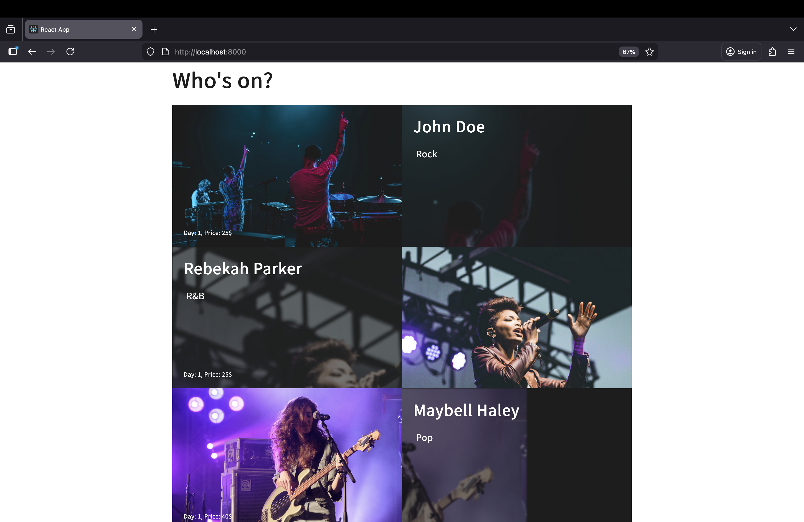
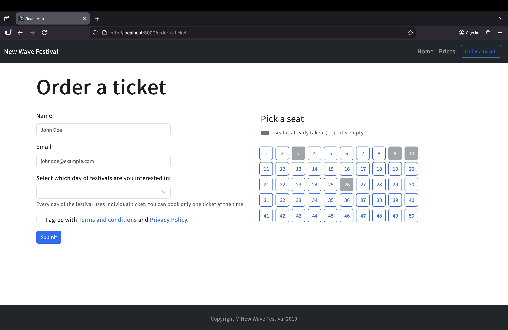

# New Wave Fest REST API

## Overview
This project is a full-stack festival booking app with:
- Express-based REST API (`/api/...`) for testimonials, concerts, and seats.
- React frontend for browsing concerts and reserving seats.
- In-memory data store (`db.js`) used by backend routes.

Main API groups:
- `/api/testimonials`
- `/api/concerts`
- `/api/seats`

Seat reservations are validated on the server side to prevent booking the same seat for the same day twice.

## Run locally

### Prerequisites
- Node.js 18+ (recommended: latest LTS)
- Yarn 1.x

### 1. Install backend dependencies
From project root:

```bash
yarn install
```

### 2. Install frontend dependencies
From project root:

```bash
cd client
yarn install
```

### 3. Start backend (API)
From project root:

```bash
node server.js
```

Backend runs on:
- `http://localhost:8000`

### 4. Start frontend
In a second terminal:

```bash
cd client
yarn start
```

Frontend runs on:
- `http://localhost:3000`

## Example images

### Concerts


### Seats

